# Net Practice

<p align="center">
	
</p>

## Overview
That project is the first networking project of the school, it aims to introduce to the concept of subnets, ip and masks. The goal is to achieve the 10 exercices and to do 3 randoms exercices between level 6 and 10 in less than 15 minutes. There is of course some explanations to give to the corrector about the choices made.

## Usage

1. Launch the project
	```bash
	google-chrome net_practice/net_practice.1.5/net_practice/index.html
	```
2. Start
	- Enter your login or random string if you don't have any
	- Or leave blank if you want to enter exam mode

## Exercices

<details>
  <summary>Level 1</summary>
  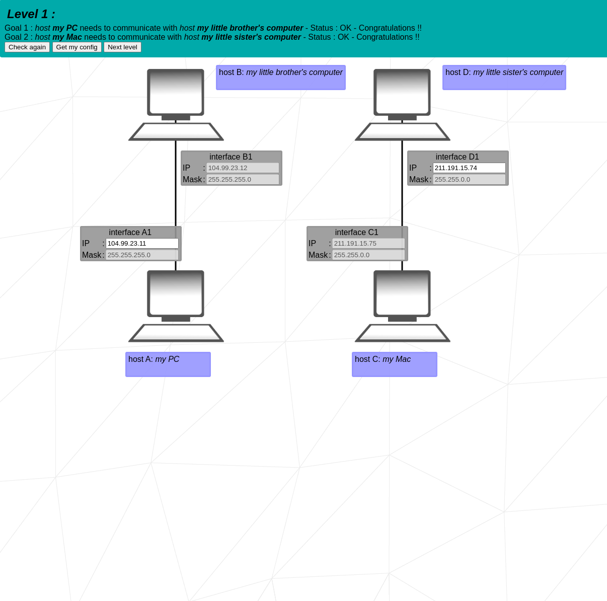

  ##### Explainations:
  This is pretty straight forward since there is no rotuer nor switches. There is two subnets 2 machines in each, you should add the ip that match the other one according to the mask.
</details>

---

<details>
  <summary>Level 2</summary>
  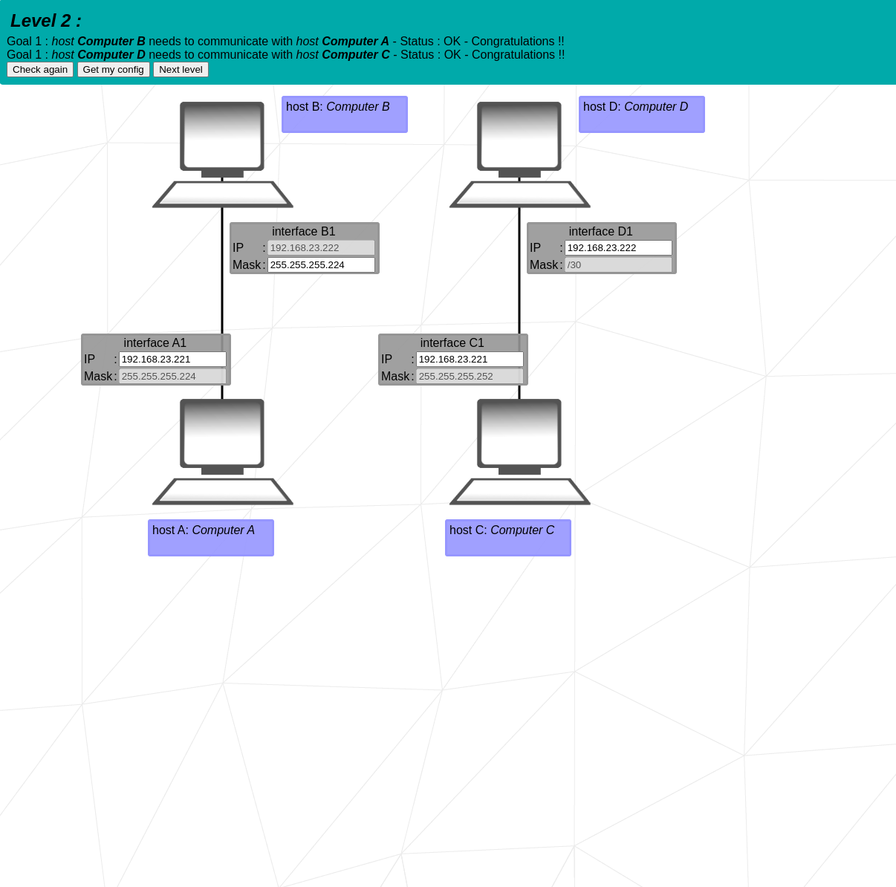

  ##### Explainations:
  Same as exercice 1 you have to match them, this time you are given the possibility to change the mask, the mask in a subnet should match so that the machines can talk to each others. 
  _NB: the usage of an ip starting by `192...` will work only in the local context, this won't work if you try to connect it to the web. However we have to change the ip starting by `127...` that is the localhost and are reserved by the machine_
</details>

---

<details>
  <summary>Level 3</summary>
  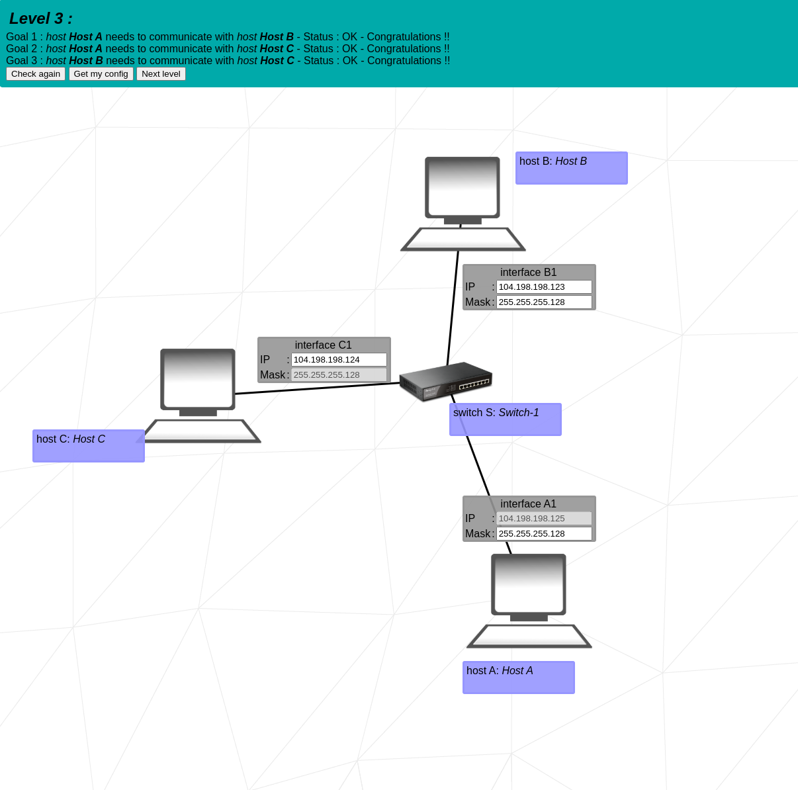

  ##### Explainations:
  You should put all the masks the same, in order to make it work. The ip are then to be changed according to the mask limits.
</details>

---

<details>
  <summary>Level 4</summary>
  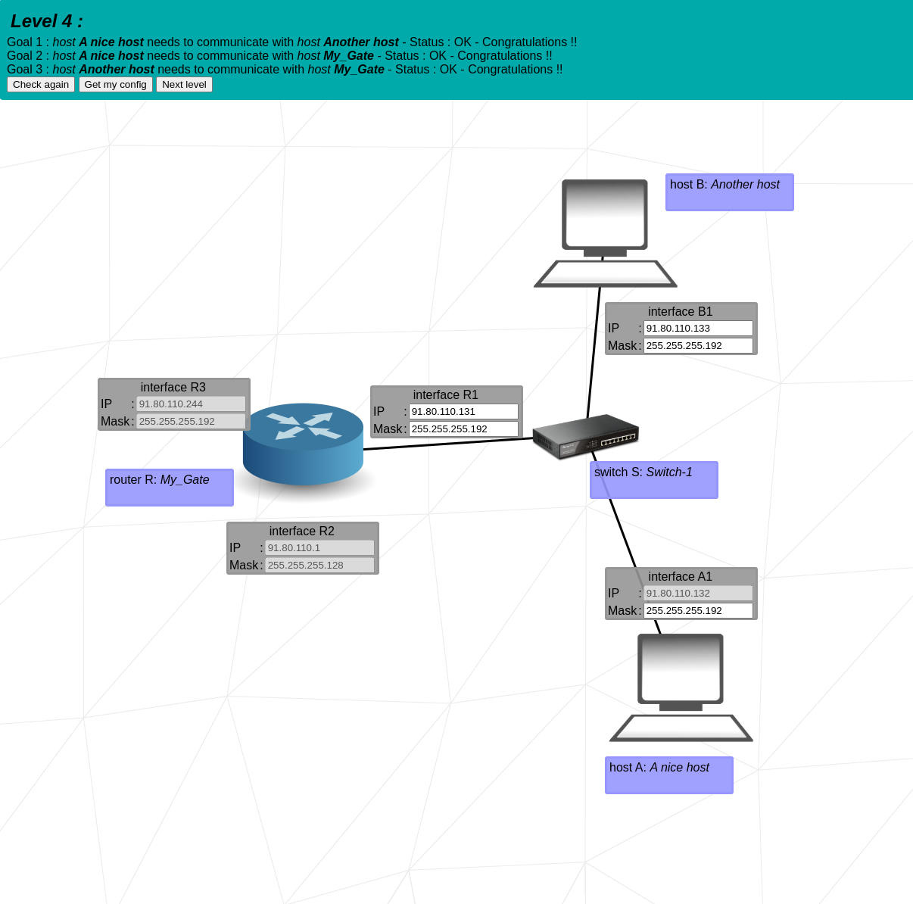

  ##### Explainations:
  Our first router, the router should pass the signal to a subnet, in our case the mask to apply is `255.255.255.192` cause it is receiving it. 
  The ip are then to be changed according to the mask, watch out there is one that is not changeable all the modifications should thus be made taking that machine ip into account. 
</details>

---

<details >
  <summary>Level 5</summary>
  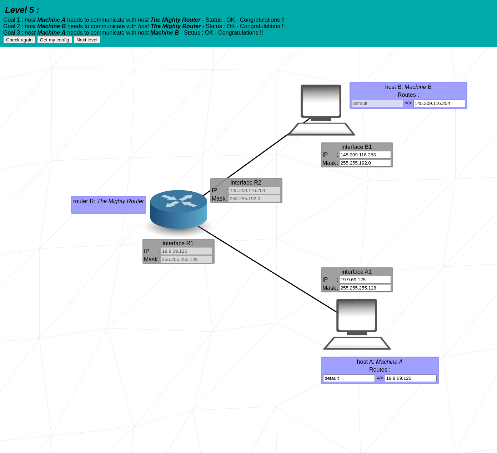

  ##### Explainations:
  Match the mask and the ips on the different way of the router, this is the first time we are seeing these blue rectangle asking us for routes. The first input field is for final destination ip and mask with `CIDR notation`.
  The second input field is the address of the next IP. Be sure to do that modification at the end of the matching of IPs so that you dont have to modify it twice. 
</details>

---

<details>
  <summary>Level 6</summary>
  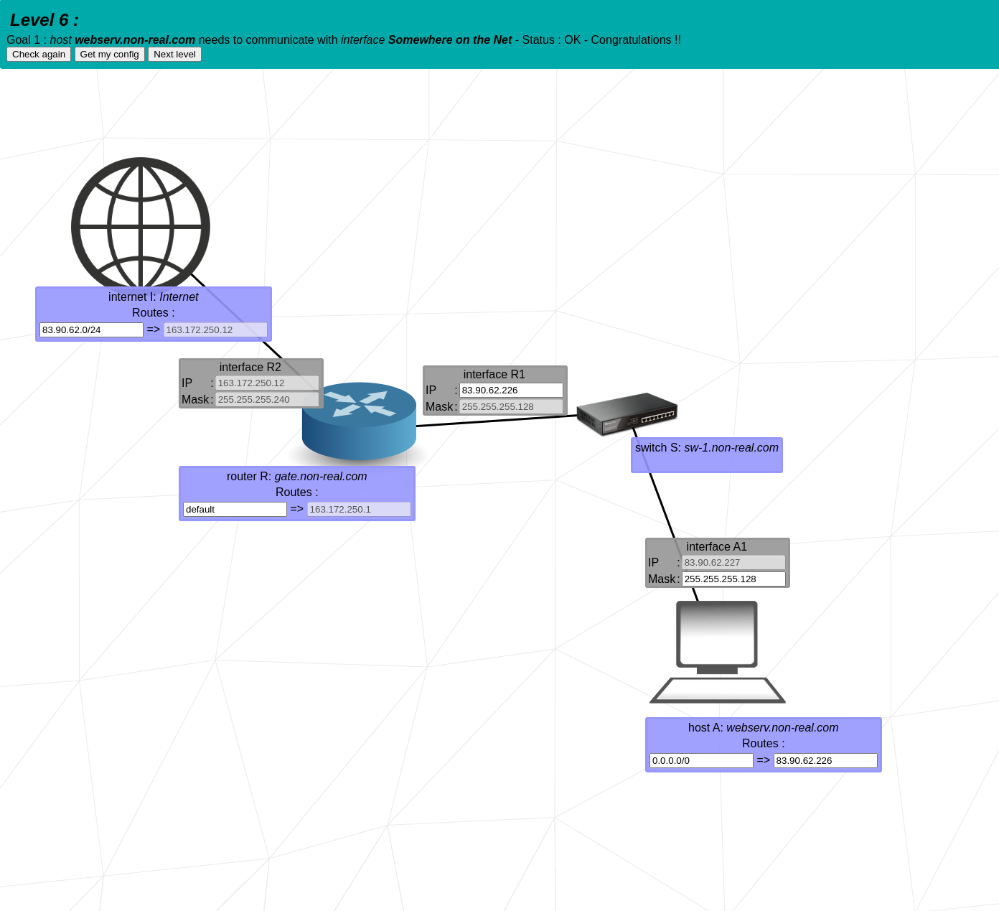

  ##### Explainations:
  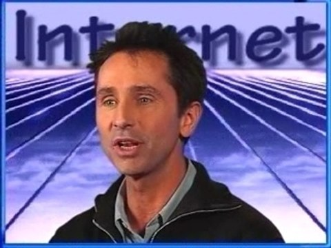
  <br/>
  First time we have to deal with internet in our network. Here we will have to get the ip locked and apply a matching oneto the switch. Change the very next route of the webserv machine. 
  The final dest of the gate is default and match the mask of the network for internet with the CIDR notation.

  _NB: the last destination of internet is `83.90.62.0` the `0` matches any ip since there is only one machine that has to be connected to the web it could as well be the machine's IP_
</details>

---

<details open>
  <summary>Level 7</summary>
  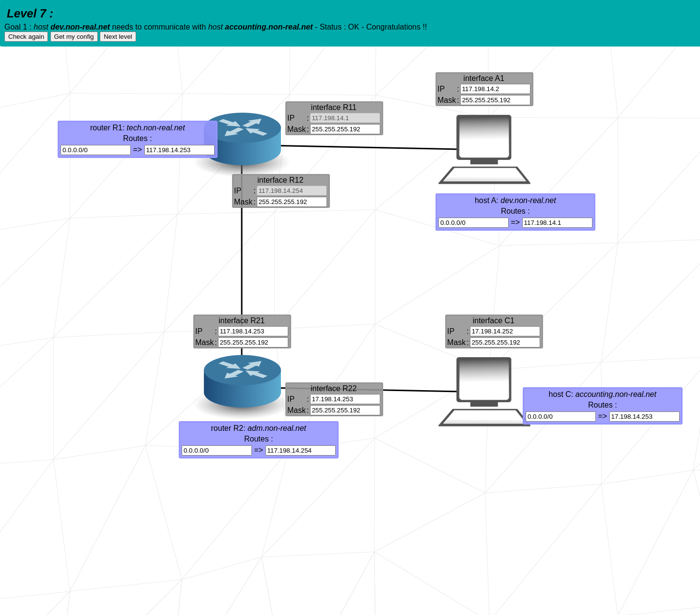

  ##### Explainations:
  Loop no difficulty, the mask must be `255.255.255.192` in order to let a wide enough range to let `117.198.14.1` and `117.198.14.200` range without overlapping each other.
</details>

---

<details>
  <summary>Level 8</summary>
  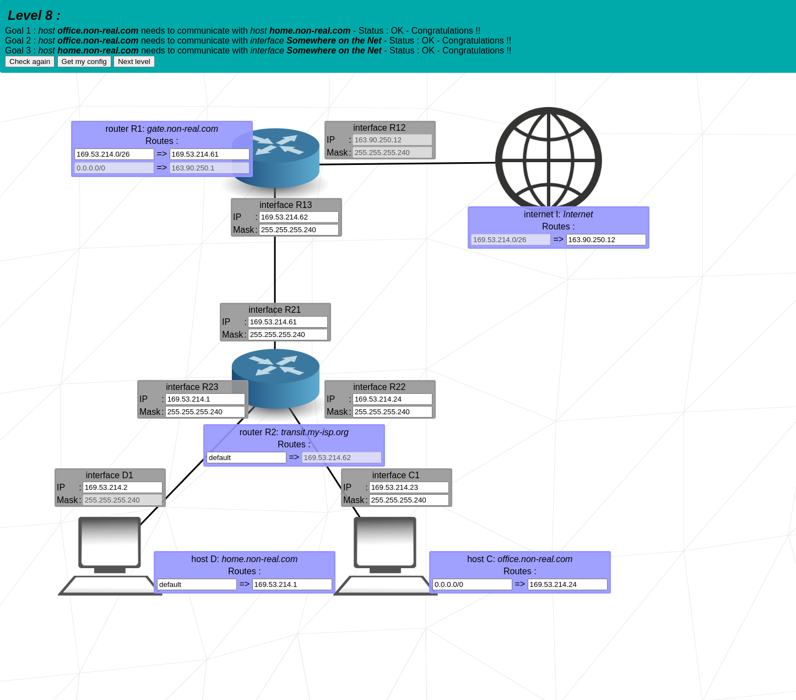

  ##### Explainations:
  Connect all to the last destination given by the routes of internet. mask is `255.255.255.240` to let the multiple ranges coexist without overlapping.
</details>

---
<details>
  <summary>Level 9</summary>
  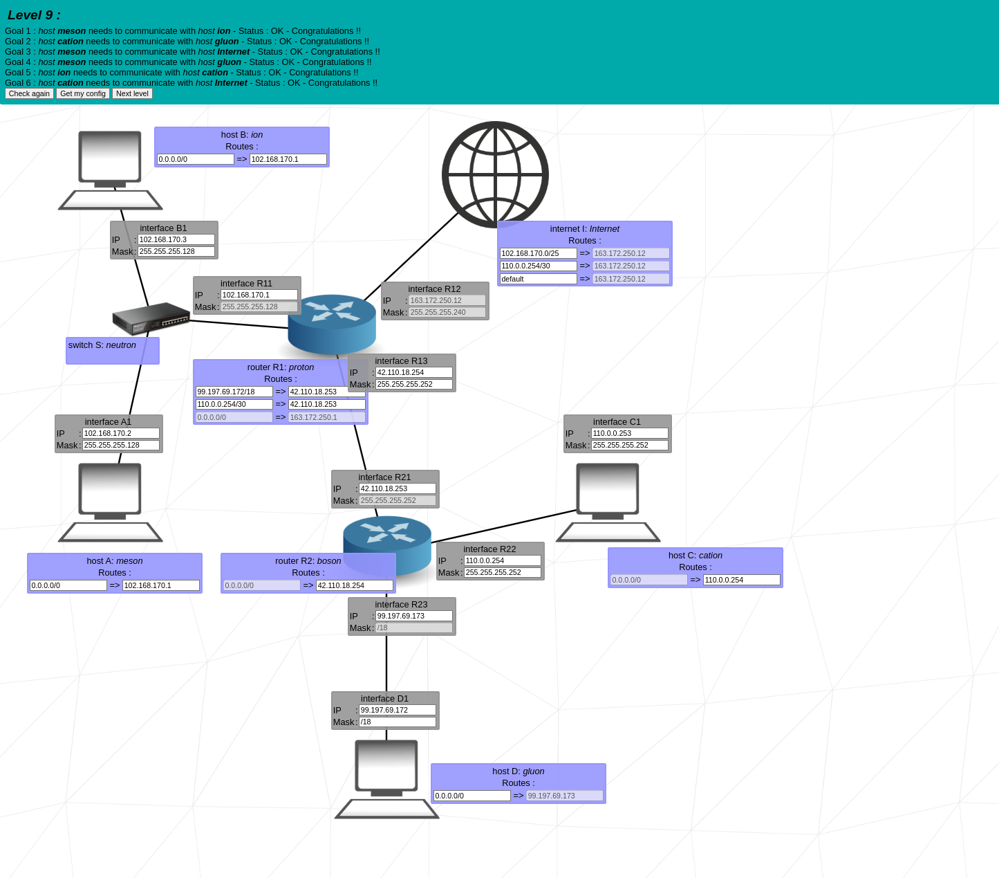

  ##### Explainations:
  There is no specific explaination, the principle is the very same as we saw on all exercices, it is just wider.
</details>

---

<details>
  <summary>Level 10</summary>
  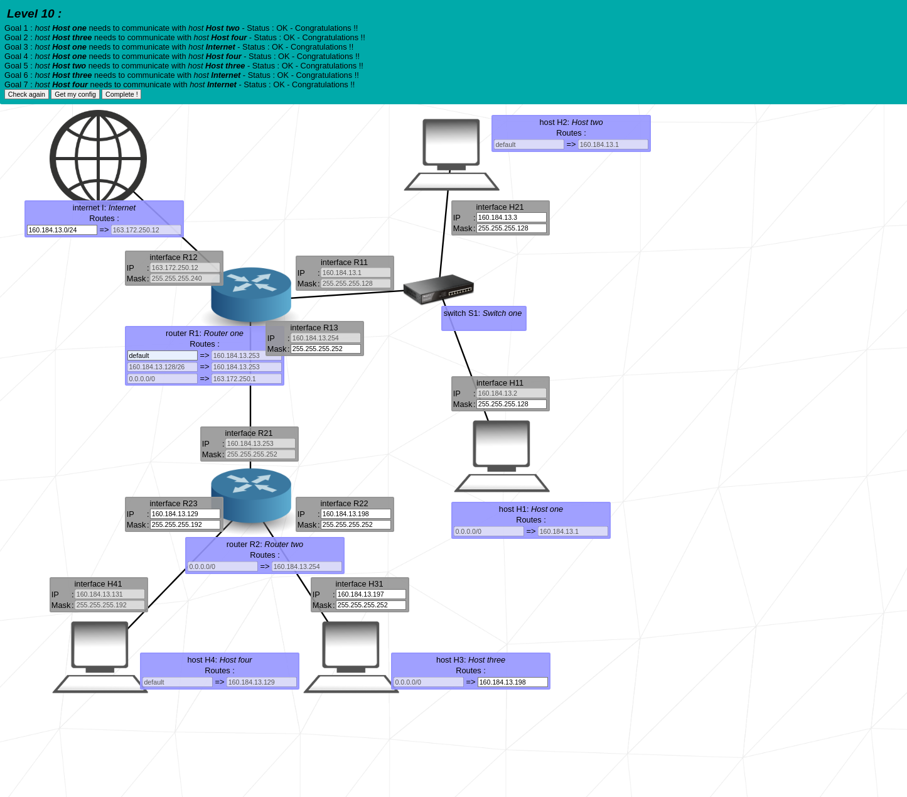

  ##### Explainations:
  There is no specific explaination, the principle is the very same as we saw on all exercices, it is just wider.
</details>

---
## License

This project is licensed under the MIT License. See the [LICENSE](LICENSE) file for details.
The project Netpractice however is under another license used in there working dir see it following [this link](./net_practice.1.5/net_practice/License) 
